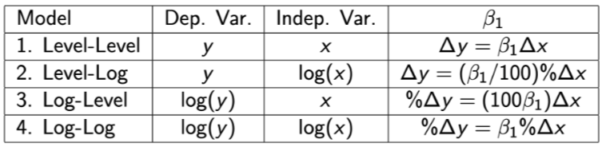

<!-- omit in toc -->
# *ECON 3032-01: Applied Econometrics* 
<!-- omit in toc -->
# *Ethan Jiang, Vanderbilt University*
---
# **Table of Contents**
- [**Table of Contents**](#table-of-contents)
    - [Basic Information](#basic-information)
    - [Chapter 1](#chapter-1)
      - [Review: F-distributions](#review-f-distributions)
    - [Chapter 2](#chapter-2)
      - [Simple regression](#simple-regression)
      - [Goodness-of-fit test](#goodness-of-fit-test)
      - [Log transformations in linear regression models](#log-transformations-in-linear-regression-models)
    - [Chapter 3](#chapter-3)
      - [Multiple regression analysis](#multiple-regression-analysis)
      - [Comparing $\tilde\beta_1, \hat\beta_1$](#comparing-tildebeta_1-hatbeta_1)
      - [Upward vs. downward bias](#upward-vs-downward-bias)
      - [Regression through origin](#regression-through-origin)
      - [Sampling variances of $\hat\beta_i$s](#sampling-variances-of-hatbeta_is)
      - [Multicollinearity](#multicollinearity)
      - [Choosing between models](#choosing-between-models)
      - [Assumptions for MLR](#assumptions-for-mlr)
      - [Exogenous, endogenous variables](#exogenous-endogenous-variables)
      - [Gauss-Markov Theorem](#gauss-markov-theorem)
      - [Relative efficiency of estimators](#relative-efficiency-of-estimators)
    - [Chapter 4](#chapter-4)
      - [Additional assumption on $u$ for MLR inference](#additional-assumption-on-u-for-mlr-inference)
      - [Population assumptions for Classical Linear Model](#population-assumptions-for-classical-linear-model)
      - [Making the $u$-normality assumption](#making-the-u-normality-assumption)
      - [$t$ distribution](#t-distribution)
      - [Hypothesis testing - value of a single parameter](#hypothesis-testing---value-of-a-single-parameter)
      - [Discussing economic & statistical significance](#discussing-economic--statistical-significance)
      - [Confidence intervals](#confidence-intervals)
      - [Hypothesis testing - linear combination of parameters](#hypothesis-testing---linear-combination-of-parameters)
      - [Partial $F$-test](#partial-f-test)
      - [Using $F$-test for validity of the overall model](#using-f-test-for-validity-of-the-overall-model)
---
### Basic Information

- Python v. 3.6+
- TA office hours via Zoom
- precede any emails with "ECON3032"
- midterms cannot be rescheduled
- grading
    - Midterm 1 - **20%**
    - Midterm 2 - **25%**
    - Final - **35%**
    - Homework - **20%**
        - 10-12 total problem sets, lowest two dropped
        - name homework files as "hwX_FirstLast.pdf"
---
### Chapter 1

- econometrics: applying theory to data
    - can be used to estimate *effect* and/or *magnitude of effect* of policy, or to *forecast economic variables*
- different distributions can result in the same regression result (see **Anscombe's Quartet** as an example)
    - thus data visualization is important
- empirical data types
    - **observational**: correlation & causation hard to differentiate
    - **experimental**: may yield correlation/causation info

#### Review: F-distributions
- *Ratio of Two Variances Test*
  - assume $\exists$ two populations $i=1,2$ where $P_i \sim N(\mu_i, \sigma_i)$
    - population parameters are unknown - use test statistics to infer their values
  - test is used when:
    - variance values of populations are directly in question
    - determine whether equal variances can be assumed in **$t$-test for difference in means**
  - note: $\chi^2$ is used for variance of *one* population
    - an $F$-statistic is obtained by taking the ratio of two $\chi^2$ distributed variables, e.g. $s_1$ and $s_2$ (see below)
  - normal test hypotheses
    $$H_0:\frac{\sigma_1^2}{\sigma_2^2}=1$$
    - $H_1$ can be $\ne 1$ (two-tailed), $\lt 1$, or $\gt 1$ (latter two are one-tailed)
      - for variance analysis for mean difference $t$-test, use $\ne$ (as direction of possible difference does not matter)
  - $F$-statistic
    $$F=\frac{s_1^2}{s_2^2}$$
  - confidence interval
    $$\frac{F}{F_{\alpha/2, k_1, k_2}} < \frac{\sigma_1^2}{\sigma_2^2} < \frac{F}{F_{1-(\alpha/2), k_1, k_2}}$$
    - $k_i=n_i-1$ (degrees of freedom)
      - pay attention to which $k$ is which
      - $k_1$ corresponds to d.o.f. of the *numerator* of the $F$-statistic (i.e. $s_1$), $k_2$ to the *denominator*
    - obtaining $F$-distribution values using Python
      - example with typical $\alpha$ for two-tailed test
        ```python
        from scipy.stats import f
        def main():
            alpha = .05
            df1 = ...
            df2 = ...
            s1 = ...
            s2 = ...
            testStat = pow(s1/s2, 2)
            # denominator values for CI bounds
            # if testStat exceeds lower or upper bound (see notes), reject
            # isf: "inverse survival function"
            lowerCV = f.isf(alpha/2, df1, df2)
            upperCV = f.isf(1-alpha/2, df1, df2)

            # p-value: gives us smallest alpha at which we can reject
            # multiply by 2 for two-tailed test
            p = 2*f.sf(testStat, df1, df2)
        ```

### Chapter 2

#### Simple regression
- definition of **regression model**
  - simple linear: $y=f(x)$
  - multiple linear: $y=f(x_1,x_2,...)$
- issues
  - need to determine factors affecting dependent var
  - functional relationship b/w $y$ and $x_i$?
  - are we capturing a *ceteris paribus* relationship?
  - what are the consequences of omitting vars from the regression?
- **simple regression model** (one explanatory variable)
  $$y=\beta_0+\beta_1 x+u$$
  - $u \in \mathbb{R}$ is the error term
    - describes "intrinsic randomness" of human behavior not predictable by independent var(s)
  - $y$ is the dependent variable (dependent on the independent variable $x$)
  - $\beta_0, \beta_1$ are population constant & slope, respectively
  - interpreting $\beta_1$
    - it should be obvious that $\frac{\delta y}{\delta x}=\beta_1$ when $\Delta u = 0$, i.e. $u \in \mathbb{R}$
- **assumptions**
  1. $E(u) = 0$
     - assumed WLOG
     - presence of $\beta_0$ allows this, since we can always adjust it s.t. this assumption is held)
  2. $E(u|x) = E(u) = 0 \; \forall x$
     - " $u$ is *mean independent* of $x$ "
     - i.e. assumption 1 holds at each value of $x$
     - important for lurking vars, which may seem to demonstrate a false relationship between $x$ and $y$ (whereas some var $z$ actually affects $x$ and $y$ but is only accounted for in $u$)
     - note that this assumption implies Assumption 1 and $Cov(x,u)=0$
- **population regression function**
  $$\begin{aligned} E(y|x) &= E[(\beta_0+\beta_1 x+u)|x] \\\\ &= E(\beta_0|x) + E(\beta_1 x | x) + E(u|x) \\\\ &= \beta_0+\beta_1 x \end{aligned}$$
  - implies the population regression function is a linear function of $x$
- estimating $\beta_0$ & $\beta_1$ (**ordinary least squares (OLS) method**)
  - recall: we call these estimates $\hat\beta_0$, $\hat\beta_1$
  - let us have a random sample $(x_i, y_i) \; | \; i=1,2,\dots,n$
  - our previous assumptions apply: $E(u)=0$, $Cov(x,u)=0$
    - $Cov(x,u)=E(xu)-E(x)E(u)$, so $E(xu)=0$
  - deriving conditions
  $$ \begin{aligned} E(u) &= E(y - \beta_0 - \beta_1 x) = 0 \\\\ 0 &= \frac{\sum_{i=1}^n (y_i - \hat\beta_0 \hat\beta_1 x_i)}{n} \tag{1} \end{aligned} $$
  $$ \begin{aligned} E(xu) &= E(x(y - \beta_0 - \beta_1 x)) = 0 \\\\ 0 &= \frac{\sum_{i=1}^n [x_i(y_i - \hat\beta_0 - \hat\beta_1 x_i)]}{n} \tag{2} \end{aligned} $$
    - derivation continues (see *Chapter 2* slides on Brightspace)
  - **resulting equations**
  $$\hat\beta_0 = \hat y - \hat\beta_1\bar x$$
  $$\hat\beta_1 = \frac{\sum_{i=1}^n (x_i-\bar x)(y_i-\bar y)}{\sum_{i=1}^n {(x_i-\bar x)}^2} = \frac{\text{Sample Cov}(x_i, y_i)}{\text{Sample Var}(x_i)}$$
- fitted/predicted values for $y_i$
  - defined by
  $$\hat y_i = \hat\beta_0 + \hat\beta_1 x_i$$
- residual of $y_i$
  - defined by
  $$\hat u_i = y_i - \hat y_i = y_i - \hat \beta_0 - \hat\beta_1 x_i$$
  - we are minimizing the sum of residual squares, i.e.
  $$\sum_{i=1}^n \hat u_i^2$$
- algebraic properties of OLS
  - sample average is same as fitted average
  $$\begin{aligned} \sum_{i=1}^n \hat u_i &= 0 \\\\ y_i &= \hat y_i + \hat u_i \\\\ \implies n^{-1} \sum_{i=1}^n y_i &= n^{-1} \sum_{i=1}^n \hat y_i + 0 \\\\ \implies \bar y &= \hat y \end{aligned}$$
  - sample covariance (and thus correlation) b/w any $x_i$ and $\hat u_i$ is 0
  $$\sum_{i=1}^n x_i\hat u_i = 0$$
  - $\hat y_i$ is a linear function of $x_i$ so the above sum is also true for $\hat y_i$ and $\hat u_i$
  - $(\bar x, \bar y)$ is always on the regression line
- **assumptions of OLS method**
  1. population model is linear in parameters
  2. given a random sample $(x_i, y_i) \; | \; i \in \{1, \dots, n\}$ that follows population model $y = \beta_0 + \beta_1 x + u$
  3. $x_i$ differs in at least one value
  4. $E(u|x)=0$
  5. $Var(u|x)=\sigma^2$, i.e. error has same variance for any given value of $x$ (*homoskedasticity*)
  - bias of estimators dependent on assumptions 1-4, assumption 5 needed for $Var(\hat\beta_1)$
- recall: estimator bias
  - $\hat \theta$ is an unbiased estimator of $\theta$ if
  $$E(\hat\theta) = \theta$$
  - if $\hat \theta$ biased, then
  $$Bias(\hat \theta) \coloneqq E(\hat \theta) - \theta$$
- variance of $\hat \beta_1$
  - recall that we define the total sum of squares (SST) by
  $$SST_x \coloneqq \sum_{i=1}^n {(x_i - \bar x)^2}$$
  - thus $Var(\hat \beta_1)$ is
  $$Var(\hat \beta_1) = \frac{\sigma^2}{SST_x}$$
  ($\sigma^2 = Var(u)$, i.e. *error variance*)
  - implications
    - $Var(\hat \beta_1)$ increases if $\sigma^2$ increases (residuals tend to deviate more) or $SST_x$ decreases (less variation between $x_i$, which makes it harder to predict slope)
    - note that $Var(y|x)=Var(u|x)=\sigma^2$
- variance of $\hat \beta_0$
  $$\begin{aligned} \hat\beta_0 &= \bar y - \hat\beta_1\bar x \\\\ Var(\hat\beta_0) &= Var(\bar y - \hat\beta_1\bar x) \\\\ Var(\hat\beta_0) &= \frac{\sum_{i=1}^n x_i^2}{n}Var(\hat\beta_1)\end{aligned}$$
- estimating $\sigma^2$
  - usually is unknown - we find $\hat\sigma^2$ so we can estimate $Var(\beta_0), Var(\beta_1)$
  $$\hat\sigma^2 = \frac{\sum_{i=1}^n \hat u_i^2}{n-k-1} \coloneqq \frac{SSR}{n-k-1}$$
  - $SSR$: residual sum of squares
  - $k$: number of independent variables
  - **standard error (SER)** defined to be $\sqrt{\hat\sigma^2}$
    - standard deviation of observed data around the regression line: *"how well" the model fits the data*
    - measured in units of the *dependent* variable, compared to $\bar y$
    - smaller SER is better
    - obtained in python via `np.sqrt( .scale)`, where `.scale` is obtained from regression output table
- detecting heteroskedasticity
  - recall our homoskedasticity assumption: $Var(u|x) = \sigma^2 \; \, \forall x$
  - if this fails (i.e. variance of residuals is dependent on one or more ind. vars), how do we visually detect it?
  - use of *residual plots*
    - examine plots of residuals vs. $x$ (simple regression) or vs. $\hat y$ (multiple regression)
    - no pattern should be observed
  - consequences of heteroskedasticity
    -  OLS estimator no longer the best linear unbiased estimator
       -  OLS estimator is still unbiased, but $\exists$ some other estimator with a **smaller variance**
    -  standard errors of $\hat \beta_0, \; \hat \beta_1$ are incorrect
       -  this can affect confidence intervals, hypothesis testing
       -  may lead to incorrect conclusions
 - fixing heteroskedasticity
   - if we see patterns in the residual plot, consider adding more variables or adjusting current variables (e.g. $\log x$ rather than just $x$)

#### Goodness-of-fit test
- tests whether correlation coefficient $R$ b/w $y_i, \hat y_i$ is nonzero (where $y_i$ is observed $y$ values, $\hat y_i$ is fitted $y$ values)
$$H_0: R = 0$$
$$H_1: R \ne 0$$
- $R$ is called **multiple R**
- note that $R = \sqrt {R^2}$, the coefficient of determination
  - recall that $R^2=0$ indicates very poor fit, $R^2=1$ means perfect linear fit
- test statistic
  $$F = \frac{\frac{R^2}{k}}{\frac{1-R^2}{n-k-1}}$$
  - $F$ evaluated relative to $F_{k,n-k-1}$ distribution
- recall
  - $SST$ is sum of squares of $y_i-\bar y$
  - $SSE$ is sum of squares of $\hat y_i - \bar y$
  - $SSR$ sum of squared residuals
  - divide any of the above by $n$ to obtain *sample variance* of $y_i, \hat y_i, \hat u_i$ respectively
$$SST = SSE + SSR$$
- defining $R^2$ mathematically
$$R^2 = \frac{SSE}{SST} = 1 - \frac{SSR}{SST}$$

#### Log transformations in linear regression models
- "level-level" regression specification
  $$y = \beta_0 + \beta_1 x + u$$
  - model uses raw values ("levels") of the data
  - e.g. standard regression model
  - in this specification, $\frac{dy}{dx}=\beta_1$
- "log-level" regression specification
  $$\log y = \beta_0 + \beta_1 x + u$$
  - in this specification, $\frac{dy}{dx}=\beta_1 e^{\beta_0 + \beta_1 x + u} = \beta_1 y$
  - $\implies \beta_1 = \frac{1}{y}\frac{dy}{dx}$, i.e. marginal efect of $x$ on $y$ is affected by value of $y$
- "log-log"
  $$\log y = \beta_0 + \beta_1 \log x + u$$
  - $\implies \beta_1 = \frac{x}{y}\frac{dy}{dx}$
- "level-log"
  $$y = \beta_0 = \beta_1 \log x + u$$
  - $\implies \beta_1 = x \frac{dy}{dx}$
- summary


- finding precise change in $y$
  - ex. $\log y = \beta_0 + \beta_1 x + u$
  - interpret the change in $y$ ($\frac{y_2-y_1}{y_1}$) when $\Delta x = 1$
  $$\begin{aligned} \log y_2 - \log y_1 &= \beta_1 \\\\ e^{\log \frac{y_2}{y_1}} &= e^{\beta_1}\\\\ \frac{y_2}{y_1} &= e^{\beta_1} \\\\ \implies \frac{y_2-y_1}{y_1} &= e^{\beta_1}-1 \end{aligned}$$
  - proportion of change is thus $e^{\beta_1} - 1$

### Chapter 3
#### Multiple regression analysis
- incorporate >1 explanatory factor into the model
  - still hold all other factors (in $u$) constant
- multiple regression model
  $$y_i = \beta_0 + \sum_{j=1}^k \beta_j x_{ij} + u_i$$ 
  - $i \in \{1, \dots, n\}$ and $j \in \{1, \dots, k\}$ (sample size and # of ind. vars respectively)
  - i.e. sample regression line is $\hat y = \hat \beta_0 + \sum_{i=1}^k \hat \beta_i x_i$
- interpreting MLR
  - $\hat \beta_i$ measures relationship b/w $y, x_i$ after partailing out all other ind. vars
- polynomial form
  - e.g. $y = \beta_0 + \beta_1 x + \beta_2 x^2 + u$
  - explanatory vars: $x,x^2$
  - marginal effect of $x$ on $y$ is found via $\frac{\delta y}{\delta x}$
- overspecification
  - assume a variable has no real effect on $y$ assuming control of other factors (i.e. its $\beta$ in population regression is 0)
  - doesn't affect unbiasedness of other $\hat \beta$s, but may increase sampling variance of these factors
- underspecification (omitted variable bias)
  - suppose the true population model is $y = \beta_0 + \beta_1 x_1 + \beta_2 x_2 + u$
  - let us wrongly estimate this with $\tilde y = \tilde \beta_0 + \tilde \beta_1 x_1$ (whereas $\hat y = \hat \beta_0 + \hat \beta_1 x_1 + \hat \beta_2 x_2$ is the correct estimate)
    - ~ denotes simple regression (underspecified)
    - ^ denotes multiple regression (correct model)
  - in this case, $x_2$ is our **confounder**
    - omitted from regression, but correlated to both $x_1$ and $y$
    - we define another regression for population model $x_2 = \delta_0 + \delta_1 x_1 + v$
      - define slope of this sample regression to be $\tilde \delta_1$
  - from this, we can show that
    $$\tilde \beta_1 = \hat \beta_1 + \hat \beta_2 \tilde \delta_1$$
    - we call $\hat \beta_2 \tilde \delta_1$ the **omitted variable bias**
    - proof
      - we are given:
        $$\begin{aligned} \text{underspecified: } y &= \tilde \beta_0 + \tilde \beta_1 x_1 + \tilde u \\\\ \text{true: } y &= \hat \beta_0 + \hat \beta_1 x_1 + \hat \beta_2 x_2 + \hat u \\\\ \text{confounder: } x_2 &= \tilde \delta_0 + \tilde \delta_1 x_1 + \tilde \epsilon\end{aligned}$$
      - thus
        $$\begin{aligned} y &= \hat\beta_0 + \hat\beta_1 x_1 + \hat\beta_2 x_2 + \hat u \\\\ &= \hat\beta_0 + \hat\beta_1 x_1 + \hat\beta_2 (\tilde \delta_0 + \tilde \delta_1 x_1 + \tilde \epsilon) + \hat u \\\\ &= \hat\beta_0 + \hat\beta_1 x_1 + \hat\beta_2\tilde \delta_0 + \hat\beta_2\tilde \delta_1 x_1 + \hat\beta_2\tilde \epsilon + \hat u \\\\ &= \hat\beta_0 + \hat\beta_2\tilde \delta_0 + (\hat\beta_1 + \hat\beta_2\tilde \delta_1)x_1 + \hat\beta_2\tilde \epsilon + \hat u \end{aligned}$$
      - comparing to the underspecified model,
        $$\tilde\beta_0 = \hat\beta_0 + \hat\beta_2 \tilde\delta_0$$
        $$\tilde\beta_1 = \hat\beta_1 + \hat\beta_2 \tilde\delta_1$$
        $$\tilde u = \hat\beta_2 \tilde\epsilon + \hat u$$
#### Comparing $\tilde\beta_1, \hat\beta_1$
1. $\hat\beta_2 > 0$ ($x_2$ has positive effect on $y$) AND $\tilde\delta_1 > 0$ ($x_1,x_2$ positively correlated)
    - OR both $<0$
    - $\tilde \beta_1 > \hat \beta_1$
2. $\hat\beta_2 < 0$ ($x_2$ has negative effect on $y$) OR $\tilde\delta_1 < 0$ ($x_1,x_2$ negatively correlated)
    - $\tilde \beta_1 < \hat \beta_1$
3. $\tilde\beta_1, \hat\beta_1 = 0$ (either or both)
    - $\tilde \beta_1 = \hat \beta_1$

#### Upward vs. downward bias
- $\beta_1 < \tilde\beta_1 \implies \tilde\beta_1$ has **upwards** bias
- $\beta_1 > \tilde\beta_1 \implies \tilde\beta_1$ has **downwards** bias 
- the term **biased toward zero** indicates $\tilde\beta_1$ is closer to 0 than $\beta_1$

#### Regression through origin
- $\hat\beta_0 \coloneqq 0$
  - we *impose* that the regression passes through origin
- doing this causes all $\hat\beta_i$ to be biased, unless $\beta_0 = 0$
- unless otherwise stated, do not impose this condition

#### Sampling variances of $\hat\beta_i$s
$$Var(\hat\beta_i) = \frac{\sigma^2}{(SST_i)(1-R_i^2)}$$
- recall: 
  - $SST_i$ is the sum of squares of $x_i - \bar x_i$
  - $R_i^2$ is the $R^2$ value for $x_i$ against all other ind. vars ($x_i = \delta_0 + \sum_{j=1}^k \delta_j x_j + \nu_i$)
  - $\sigma^2$ is the error variance
- if $\sigma_2$ high, sample variance also high $\implies$ large error variance makes estimates worse
  - remember that $\sigma_2$ is a population parameter and thus is not affected by sample size
  - only way to possibly reduce is to add more $x_i$s into regression, an option not always available
- however, $SST_i$ increases with sample size
  - $\implies$ larger sample size will reduce sampling variance
- likewise, sampling variance decreases if $R_i^2$ lowers
  - i.e. the *better* $x_i$ is explained by linear model of other ind. vars, the *higher* $Var(\hat\beta_i)$ is
  - this problem is called **multicollinearity** 

#### Multicollinearity
- two or more predictors are correlated
- informally: if the correlation coefficient b/w two predictors is $>|0.8|$, assume multicollinearity
  - obtained from `.corr()`
- formally: Variance Inflation Factors (VIF)
$$VIF_j = \frac{1}{1-R_j^2}$$
  - arbitrary rule: $VIF > 10$ is suspect

#### Choosing between models
- see Chapter 3 slides (slide 42 - 45)

#### Assumptions for MLR
$$y = \beta_0 + \beta_1x_1 + \dots + \beta_kx_k + u$$
1. parameters are linear ($\beta_i$s are constant)
2. random sampling
3. no perfect collinearity
    - in the sample (and therefore the population), no ind. vars are constant AND no exact linear relationships exist b/w ind. vars
4. zero conditional mean
    - error term has expected value of 0 for any values of ind. vars
    - $E(u | x_1, \dots, x_k) = 0$
5. homoskedasticity
    - error term has same variance given any values of ind. vars
    - $Var(u | x_1, \dots, x_k) = \sigma^2$

#### Exogenous, endogenous variables
- endogenous: explanatory vars correlated with $u$
  - endogeneity violates assumption 4
- exogenous: explanatory vars not correlated with $u$
  - assumption 4 holds if all $x_i$s are exogenous

#### Gauss-Markov Theorem
- under assumptions 1-5 given above, $\hat\beta_0, \dots, \hat\beta_k$ are the best linear unbiased estimators (BLUEs) of $\beta_0, \dots, \beta_k$

#### Relative efficiency of estimators
- let $W_1, W_2$ be unbiased estimators of $\theta$
- $W_1$ is *efficient* relative to $W_2$ when
  $$Var(W_1) \le Var(W_2) \; \; \forall \theta$$
- and
  $$\exists \theta \; \; Var(W_1) < Var(W_2)$$
  - i.e. $W_1 \ne W_2$
- in summary, when both estimators are unbiased, we prefer the one with a lower variance
- comparing biased estimators
  - use $MSE$ instead of $Var$
  $$MSE(W) = E((W-\theta)^2) = Var(W) + (Bias(W))^2$$

### Chapter 4
#### Additional assumption on $u$ for MLR inference
6. normality of error terms
    - imposes full independence b/w $u$ and explanatory vars
$$u \sim N(0,\sigma^2)$$
#### Population assumptions for Classical Linear Model
- define a CLM to be one that follows both **Gauss-Markov assumptions** (1-5) and **$u$ normality assumption** (6)
- as a result of these assumptions, we can conclude that
$$y | (x_1, \dots, x_k) \sim N(\beta_0 + \beta_1x_1 + \dots + \beta_kx_k, \, \sigma^2)$$
#### Making the $u$-normality assumption
- when is this not assumable?
  - variables that usually only take a small range of integer values
  - indicator variables
- however, **we can often impose the assumption of normality with sufficiently large sample size**
- as such, under CLM assumptions
$$\hat\beta_j \sim N(\beta_j, Var(\hat\beta_j))$$
$$\frac{\hat\beta_j - \beta_j}{sd(\hat\beta_j)} \sim N(0,1)$$
- usually $sd$ is unknown, so
$$\frac{\hat\beta_j - \beta_j}{se(\hat\beta_j)} \sim t_{n-k-1}$$
- (recall that $k =$ number of explanatory vars)
#### $t$ distribution
- formula definitions
$$E(t_{df}) = 0 \; \; (df > 1)$$
$$Var(t_{df}) = \frac{df}{df-2} \; \; (df > 2)$$
- we will rarely have small enough $df$ to worry about the latter conditionals
- $t$ distribution tends to be more spread out than Normal curve
  - as $df \rightarrow \infty$, $t_{df} \rightarrow N(0,1)$
#### Hypothesis testing - value of a single parameter
- $H_0: \beta_j = k, \; \; k \in \mathbb{R}$
- $t = \frac{\hat\beta_j - \beta_j}{se(\hat\beta_j)} \sim t_{n-k-1}$
  - test statistic
- compare against rejection region cutoff
  - two-tailed: $t_{\alpha/2, df}$
  - one-tailed: $t_{\alpha, df}$
- in Python:
```python
reg = smf.ols('y ~ x', data=dataHolder).fit()
reg.t.test('x = 0')
```
  - `x = 0` represents the null hypothesis $H_0: \beta_0 = 0$; adjust this accordingly
- $p$ values in $t$-tests
  - recall: $p$-value is the smallest $\alpha$ at which $H_0$ is still rejected
  - smaller $p$-value means greater evidence against $H_0$
#### Discussing economic & statistical significance
- *statistical* significance of $x_j$ is determined entirely by $t_{\hat\beta_j}$
- *economic* significance will relate to **sign and magnitude** of $\hat\beta_j$
- statistical significance DOES NOT necessarily imply economic significance
#### Confidence intervals
- two-sided
$$\hat\beta_j \pm t_{\alpha/2, n-k-1} * se(\hat\beta_j)$$
- one-sided
#### Hypothesis testing - linear combination of parameters
- $H_0$s like $\beta_1 = \beta_2$, i.e. $\beta_1 - \beta_2 = 0$
- $t = \frac{\hat\beta_1 - \hat\beta_2}{se(\hat\beta_1 - \hat\beta_2)}$
- estimate $se(\hat\beta_1 - \hat\beta_2)$
  - $= \sqrt{Var(\hat\beta_1)+Var(\hat\beta_2)-2Cov(\hat\beta_1,\hat\beta_2)}$
  - however, not always computable
  - let $\theta_1 \coloneqq \beta_1 - \beta_2$
$$H_0: \theta_1 = 0$$
$$H_2: \theta_1 < 0$$
  - $\theta_1 = \beta_1 - \beta_2 \implies \beta_1 = \theta_1 + \beta_2$
  - substitute this for $\beta_1$ in the linear model
$$\begin{aligned} y &= \beta_0 + \beta_1x_1 + \beta_2x_2 + \dots + \beta_kx_k + u \\\\ &= \beta_0 + \theta_1x_1 + \beta_2x_1 +\beta_2x_2 + \dots + \beta_kx_k + u \\\\ &= \beta_0 + \theta_1x_1 + \beta_2(x_1+x_2) + \dots + \beta_kx_k + u \end{aligned}$$
  - define $x_{sum} \coloneqq x_1 + x_2$, run regression on newly expressed model
  - use regression value for $\hat\theta_1$ to calculate test statistic $t = \frac{\hat\theta_1}{se(\hat\theta_1)}$
#### Partial $F$-test
- test whether a **group** of explanatory variables has partial effect on dependent variable (fixing all other explanatory vars)
- typically, $H_0: \beta_i = 0 \; \; \forall i \in$ group of variables being considered
  - var group collectively has no effect
- equivalent $H_1: \beta_i \ne 0 \; \; \exists i \in$ group
  - at least one of the slopes is nonzero, i.e. at least one var has an effect
- we call the original model the **unrestricted model** and the model after imposing $H_0$ (omitting vars in target group) the **restricted model**
  - which model fits the data better?
- restricted model always has lower $R^2$, higher $SSR$ - we want to know whether the increase in $SSR$ is statistically significant, or just due to decreasing the number of explanatory vars
- test statistic
  $$F = \frac{\frac{SSR_r-SSR_{ur}}{df_r-df_{ur}}}{\frac{SSR_{ur}}{n-k-1}} = \frac{(SSR_r-SSR_{ur})(n-k-1)}{SSR_{ur}(q)}$$
  - where $k$ is number of explanatory vars in unrestricted model, $q$ is the number of exclusion restrictions
  - $F \sim F_{q,n-k-1}$
  - computing $F$
    - typically done directly via computer, but we can also user $R^2_r, R^2_{ur}$ to compute
    - $SSR = (1-R^2)SST \implies$
    $$F = \frac{(R^2_{ur}-R^2_r)(n-k-1)}{(1-R^2_{ur})(q)}$$
- compare $F$ against $f_{q,n-k-1, \alpha}$ to see if greater
- if $H_0$ rejected, the excluded vars are **jointly statistically significant**
- note on effectiveness of the $F$-test
  - often more useful for testing exclusion of a *group of highly correlated variables*
  - the test has less power than $t$-tests on individual factors, so it may be the case that a var in the exclusion group is significant but the test still fails to reject $H_0$
#### Using $F$-test for validity of the overall model
- set $H_0$ s.t. all $\beta_i = 0$, i.e. none of the factors have an effect on $y$
- therefore $F=\frac{R^2(n-k-1)}{(1-R^2)(k)}$
  - $F$ increases as $R^2$ increases
  - $F$ increases as $k$ decreases